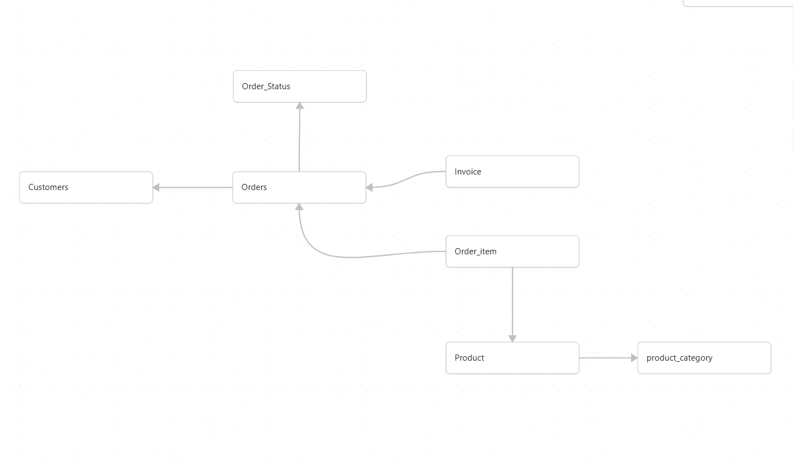

# Order Management - Sales Analytics API

A multi-layered .NET 9 Web API for managing order data and performing sales analytics. It ingests sales data from CSV files, stores it in a normalized PostgreSQL database, and exposes RESTful endpoints for querying top-selling products by category, region, and date range.

## Architecture

```
Order.API            → Controllers, Program.cs (Entry Point)
Order.Services       → Business Logic (Sales Analysis, Data Refresh)
Order.Repository     → Data Access (EF Core, CSV Loader, DB Context)
Order.Model          → Entity Definitions (9 Entities)
Order.Dto            → Request/Response DTOs
```

## Database Schema



### Tables

| Table              | Description                              |
|--------------------|------------------------------------------|
| `customer`         | Customer master data                     |
| `product`          | Product details with pricing & category  |
| `product_category` | Product classifications                  |
| `product_pricing`  | Historical pricing (effective/expiry)    |
| `order`            | Order records (GUID-based, soft-delete)  |
| `order_item`       | Order line items with quantity & pricing |
| `order_status`     | Order status lookup                      |
| `invoice`          | Billing / invoice records                |
| `refresh_log`      | CSV import audit trail                   |

### Relationships

```
Customer ──< Order ──< OrderItem >── Product >── ProductCategory
                  ──< Invoice
                  >── OrderStatus
```

## Prerequisites

- [.NET 9 SDK](https://dotnet.microsoft.com/download/dotnet/9.0)
- PostgreSQL (running locally or remotely)

## Getting Started

1. **Clone the repository**
   ```bash
   git clone https://github.com/Monk-Coders/Order-Management.git
   cd Order-Management
   ```

2. **Create the database**
   ```bash
   createdb lumel
   ```
   Run the schema script to create tables:
   ```bash
   psql -d lumel -f Order.Repository/Schema/OrderManagement.sql
   ```

3. **Update the connection string** in [appsettings.json](Order.API/appsettings.json):
   ```json
   "ConnectionStrings": {
     "OrderDB": "Host=localhost;Port=5432;Database=lumel;Username=<your_user>;Password=<your_password>"
   }
   ```

4. **Place your CSV file** at:
   ```
   Order.API/data/sales_data.csv
   ```

5. **Run the API**
   ```bash
   cd Order.API
   dotnet run
   ```
   The API will be available at `http://localhost:5295`. Swagger UI is enabled in development mode.

## API Endpoints

### Sales Analysis

| Method | Endpoint                              | Description                        |
|--------|---------------------------------------|------------------------------------|
| POST   | `/api/analysis/top-products`          | Top N products by quantity sold    |
| GET    | `/api/analysis/top-products/by-category` | Top N products filtered by category |
| POST   | `/api/analysis/top-products/by-region`   | Top N products filtered by region   |

### Data Refresh

| Method | Endpoint              | Description                    |
|--------|-----------------------|--------------------------------|
| POST   | `/api/refresh/trigger`| Trigger CSV data import        |
| GET    | `/api/refresh/logs`   | Retrieve import history logs   |

### Example Requests

**Top 5 products:**
```http
POST /api/analysis/top-products
Content-Type: application/json

{ "n": 5, "startDate": "2023-01-01", "endDate": "2024-12-31" }
```

**Top products by category:**
```http
GET /api/analysis/top-products/by-category?n=5&category=Electronics&startDate=2023-01-01&endDate=2024-12-31
```

**Trigger data refresh:**
```http
POST /api/refresh/trigger
```

## CSV Format

The CSV file should contain the following 15 columns:

| # | Column           |
|---|------------------|
| 1 | Order ID         |
| 2 | Product ID       |
| 3 | Customer ID      |
| 4 | Product Name     |
| 5 | Category         |
| 6 | Region           |
| 7 | Date of Sale     |
| 8 | Quantity Sold    |
| 9 | Unit Price       |
| 10| Discount         |
| 11| Shipping Cost    |
| 12| Payment Method   |
| 13| Customer Name    |
| 14| Customer Email   |
| 15| Customer Address |

## Key Features

- **Batch CSV Import** - Processes large files with batch commits every 5,000 rows
- **Duplicate Detection** - Skips already-imported orders using deterministic MD5-based GUIDs
- **Soft Deletes** - All entities support `is_deleted` flag
- **Audit Columns** - `created_by`, `created_dtt`, `modified_by`, `modified_dtt` on all tables
- **Import Logging** - Tracks every refresh operation with status, record counts, and errors
- **CORS Enabled** - Configured for frontend integration

## Tech Stack

- .NET 9 / ASP.NET Core
- Entity Framework Core 9
- PostgreSQL (Npgsql)
- OpenAPI / Swagger
